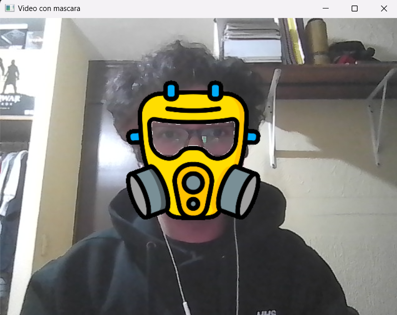
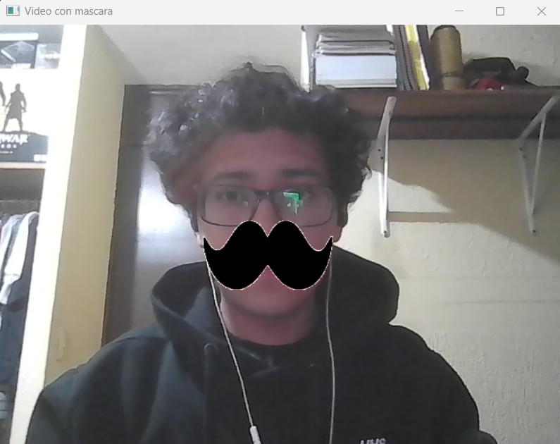
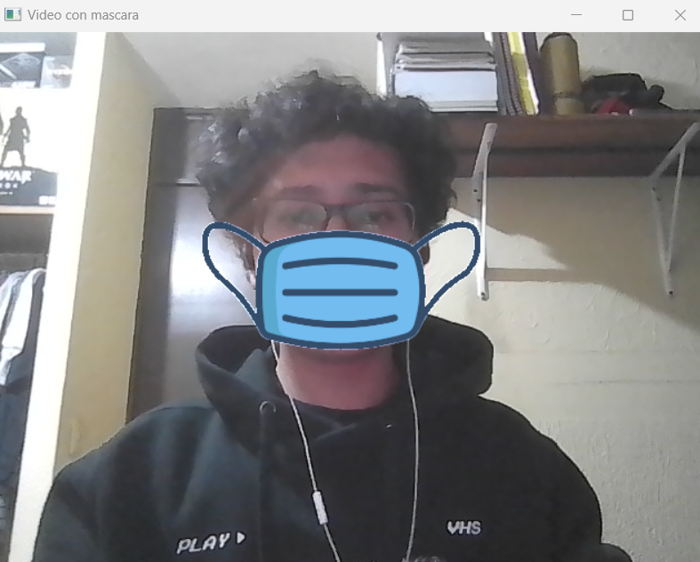
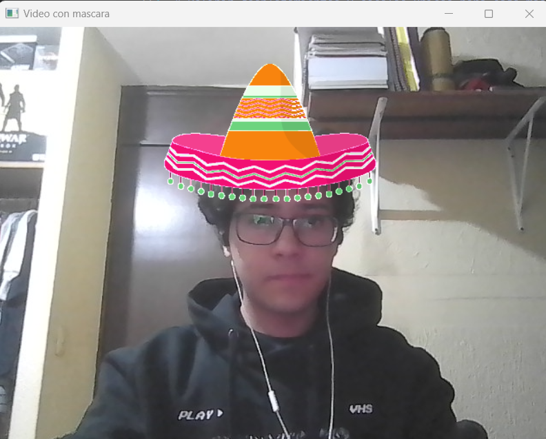
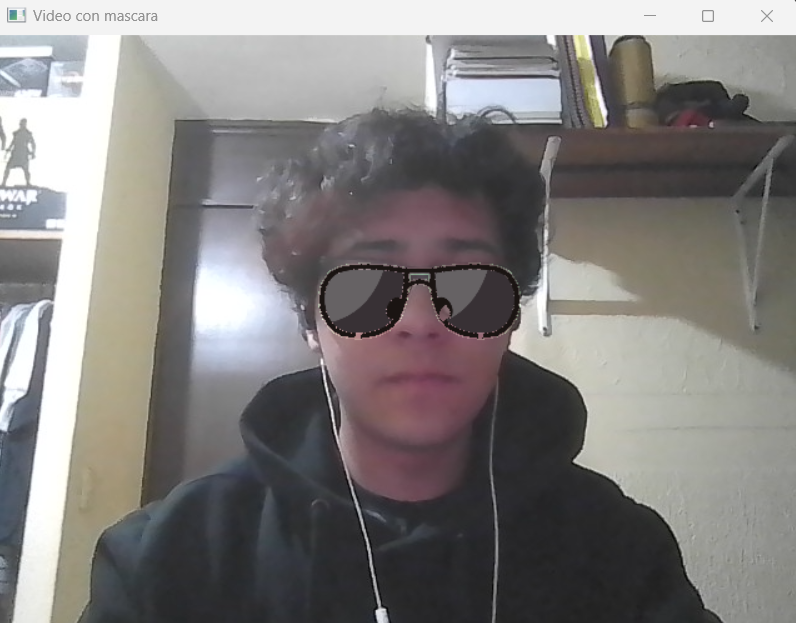

# Actividad 15

## Instrucciones

Realiza utilizar los recursos de haarcascade y usar 5 mediante un switch.  

```python
import cv2
import numpy as np

# Cargar las máscaras que deseas agregar (asegúrate de que sean PNG con transparencia)
mascaras = [
    cv2.imread('mascara.png', cv2.IMREAD_UNCHANGED),
    cv2.imread('bigote.png', cv2.IMREAD_UNCHANGED),
    cv2.imread('cubrebocas.png', cv2.IMREAD_UNCHANGED),
    cv2.imread('sombrero.png', cv2.IMREAD_UNCHANGED),
    cv2.imread('lentes.png', cv2.IMREAD_UNCHANGED)
]

# Verificar si todas las imágenes tienen canal alfa
for i, mascara in enumerate(mascaras):
    if mascara is None or mascara.shape[2] != 4:
        print(f"Error: La máscara {i+1} no tiene canal alfa o no pudo ser cargada.")
        exit()

# Inicialmente selecciona la primera máscara y sus propiedades
mascara_actual = mascaras[0]

# Definir desplazamientos y escalas únicos para cada máscara
desplazamientos = [
    (-20, -10),      # máscara 
    (0, 55),     # bigote
    (-40, 0),     # cubrebocas
    (-70, -500),   # sombrero
    (0, 0)       # lentes
]
escala_mascaras = [
    1.2,  # máscara
    1.0,  # bigote
    1.5,  # cubrebocas
    1.7,  # sombrero
    1.0   # lentes
]

# Valores iniciales de desplazamiento y escala
desplazamiento_x, desplazamiento_y = desplazamientos[0]
escala_actual = escala_mascaras[0]

# Cargar el clasificador preentrenado de rostros
face_cascade = cv2.CascadeClassifier('haarcascade_frontalface_alt2.xml')

# Capturar video desde la cámara
video = cv2.VideoCapture(0)

# Diccionario para simular un switch entre las máscaras
switch_mascaras = {
    ord('1'): 0,
    ord('2'): 1,
    ord('3'): 2,
    ord('4'): 3,
    ord('5'): 4
}

while True:
    # Leer cada frame del video
    ret, frame = video.read()
    if not ret:
        break

    # Convertir el frame a escala de grises
    frame_gris = cv2.cvtColor(frame, cv2.COLOR_BGR2GRAY)

    # Detectar los rostros en el frame
    rostros = face_cascade.detectMultiScale(frame_gris, scaleFactor=1.1, minNeighbors=5, minSize=(30, 30))

    # Procesar cada rostro detectado
    for (x, y, w, h) in rostros:
        # Calcular las dimensiones de la máscara usando la escala específica
        nueva_ancho = int(w * escala_actual)
        nueva_alto = int(h * escala_actual)
        
        # Redimensionar la máscara seleccionada para que coincida con la escala
        mascara_redimensionada = cv2.resize(mascara_actual, (nueva_ancho, nueva_alto))

        # Separar los canales de la máscara: color y alfa (transparencia)
        mascara_rgb = mascara_redimensionada[:, :, :3]
        mascara_alpha = mascara_redimensionada[:, :, 3]

        # Asegurarse de que la máscara alfa sea de tipo uint8
        mascara_alpha = cv2.convertScaleAbs(mascara_alpha)

        # Aplicar el desplazamiento a las coordenadas x e y
        x_nuevo = x + desplazamiento_x
        y_nuevo = y + desplazamiento_y

        # Evitar que la máscara salga del borde de la imagen
        if x_nuevo < 0: x_nuevo = 0
        if y_nuevo < 0: y_nuevo = 0
        if x_nuevo + nueva_ancho > frame.shape[1]: x_nuevo = frame.shape[1] - nueva_ancho
        if y_nuevo + nueva_alto > frame.shape[0]: y_nuevo = frame.shape[0] - nueva_alto

        # Crear una región de interés (ROI) en el frame donde colocaremos la máscara
        roi = frame[y_nuevo:y_nuevo+nueva_alto, x_nuevo:x_nuevo+nueva_ancho]

        # Asegurarse de que la ROI y la máscara tengan el mismo tamaño
        if roi.shape[:2] == mascara_alpha.shape[:2]:
            # Invertir la máscara alfa para obtener la parte del rostro donde se aplicará la máscara
            mascara_alpha_inv = cv2.bitwise_not(mascara_alpha)

            # Enmascarar la región del rostro en la imagen original
            fondo = cv2.bitwise_and(roi, roi, mask=mascara_alpha_inv)

            # Enmascarar la máscara RGB
            mascara_fg = cv2.bitwise_and(mascara_rgb, mascara_rgb, mask=mascara_alpha)

            # Combinar el fondo (parte del rostro sin máscara) y la parte con la máscara
            resultado = cv2.add(fondo, mascara_fg)

            # Reemplazar la región del rostro con la imagen combinada
            frame[y_nuevo:y_nuevo+nueva_alto, x_nuevo:x_nuevo+nueva_ancho] = resultado

    # Mostrar el frame con la máscara aplicada
    cv2.imshow('Video con mascara', frame)

    # Capturar la tecla presionada
    key = cv2.waitKey(1) & 0xFF

    # Usar el switch (diccionario) para cambiar la máscara si se presiona una tecla válida (1-5)
    if key in switch_mascaras:
        indice_mascara = switch_mascaras[key]
        print(f"Cambiando a la máscara {indice_mascara + 1}")
        mascara_actual = mascaras[indice_mascara]
        desplazamiento_x, desplazamiento_y = desplazamientos[indice_mascara]
        escala_actual = escala_mascaras[indice_mascara]

    elif key == ord('q'):
        break

# Liberar la captura de video y cerrar las ventanas
video.release()
cv2.destroyAllWindows()
```  
  
**Máscara**  
  
  
  
**Bigote**  
  
  
  
**Cubrebocas**  
  
  
  
**Sombrero**  
  
  
  
**Lentes**  
  
  