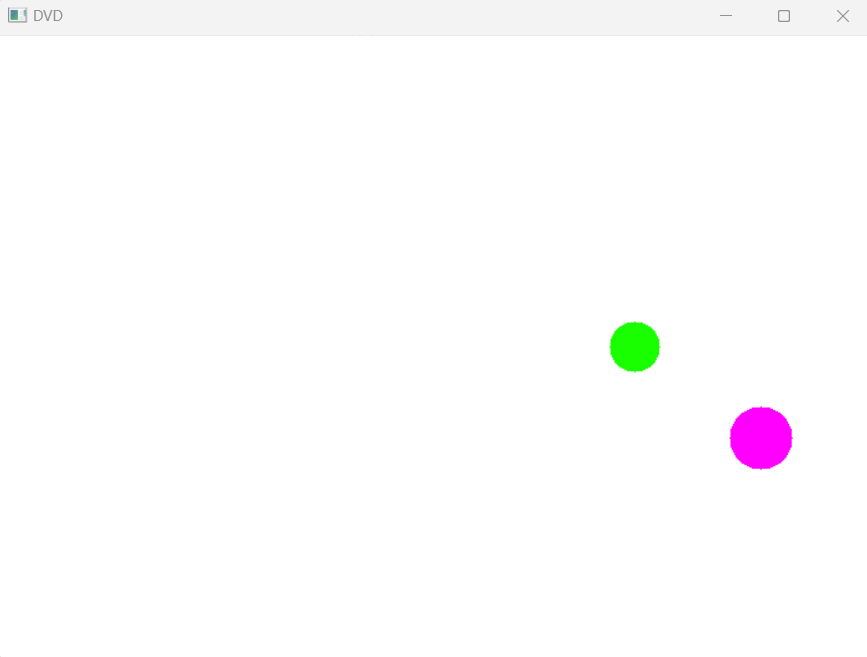

# Actividad 9

## Instrucciones

Realizar una actividad parecida a la pantalla de espera de DVD donde una imagen va dando vueltas, pero habrá 2 pelotas y una de estas (la verde) debe evitar colisionar con la otra (la rosa)  

```python
import numpy as np
import cv2

# Parámetros del lienzo y las pelotas
width, height = 700, 500  # Tamaño del lienzo
radio_pelota_1 = 25  # Radio de la primera pelota
radio_pelota_2 = 20  # Radio de la segunda pelota
color_pelota_1 = (255, 0, 255)  # Color de la primera pelota (fucsia)
color_pelota_2 = (0, 255, 25)  # Color de la segunda pelota (verde)

# Velocidades y direcciones de las pelotas
x_velocidad_1 = np.random.choice([-5, 5])  # Velocidad aleatoria en X para pelota 1
y_velocidad_1 = np.random.choice([-5, 5])  # Velocidad aleatoria en Y para pelota 1

x_velocidad_2 = np.random.choice([-4, 4])  # Velocidad aleatoria en X para pelota 2
y_velocidad_2 = np.random.choice([-4, 4])  # Velocidad aleatoria en Y para pelota 2

# Generar posición inicial aleatoria de las pelotas, respetando el radio
x_posicion_1 = np.random.randint(radio_pelota_1, width - radio_pelota_1)
y_posicion_1 = np.random.randint(radio_pelota_1, height - radio_pelota_1)

x_posicion_2 = np.random.randint(radio_pelota_2, width - radio_pelota_2)
y_posicion_2 = np.random.randint(radio_pelota_2, height - radio_pelota_2)

# Función para aplicar traslación
def traslacion(x, y, tx, ty):
    return x + tx, y + ty

# Función para evitar colisión
def distancia(x1, y1, x2, y2):
    return np.sqrt((x2 - x1)**2 + (y2 - y1)**2)

# Función para determinar el cuadrante de una pelota
def cuadrante(x, y, width, height):
    if x > width // 2 and y < height // 2:
        return 1  # Cuadrante superior derecho
    elif x < width // 2 and y < height // 2:
        return 2  # Cuadrante superior izquierdo
    elif x < width // 2 and y > height // 2:
        return 3  # Cuadrante inferior izquierdo
    else:
        return 4  # Cuadrante inferior derecho

# Lógica para cambiar la pelota verde al cuadrante opuesto
def esquivar_cuadrante(cuadrante_pelota_1, cuadrante_pelota_2):
    if cuadrante_pelota_1 == cuadrante_pelota_2:
        if cuadrante_pelota_2 == 1:
            return -abs(x_velocidad_2), abs(y_velocidad_2)  # Mover a cuadrante 2
        elif cuadrante_pelota_2 == 2:
            return abs(x_velocidad_2), abs(y_velocidad_2)  # Mover a cuadrante 1
        elif cuadrante_pelota_2 == 3:
            return abs(x_velocidad_2), -abs(y_velocidad_2)  # Mover a cuadrante 4
        else:
            return -abs(x_velocidad_2), -abs(y_velocidad_2)  # Mover a cuadrante 3
    return x_velocidad_2, y_velocidad_2

while True:
    # Crear un lienzo blanco
    img = np.ones((height, width, 3), dtype=np.uint8) * 255

    # Dibujar la primera pelota
    cv2.circle(img, (x_posicion_1, y_posicion_1), radio_pelota_1, color_pelota_1, -1)
    
    # Dibujar la segunda pelota
    cv2.circle(img, (x_posicion_2, y_posicion_2), radio_pelota_2, color_pelota_2, -1)

    # Mostrar el lienzo
    cv2.imshow("Pelotas", img)

    # Aplicar traslación (movimiento) a la primera pelota
    x_posicion_1, y_posicion_1 = traslacion(x_posicion_1, y_posicion_1, x_velocidad_1, y_velocidad_1)

    # Aplicar traslación (movimiento) a la segunda pelota
    x_posicion_2, y_posicion_2 = traslacion(x_posicion_2, y_posicion_2, x_velocidad_2, y_velocidad_2)

    # Evitar que la segunda pelota colisione con la primera
    if distancia(x_posicion_1, y_posicion_1, x_posicion_2, y_posicion_2) <= (radio_pelota_1 + radio_pelota_2):
        x_velocidad_2 = -x_velocidad_2
        y_velocidad_2 = -y_velocidad_2

    # Determinar los cuadrantes actuales de las pelotas
    cuadrante_pelota_1 = cuadrante(x_posicion_1, y_posicion_1, width, height)
    cuadrante_pelota_2 = cuadrante(x_posicion_2, y_posicion_2, width, height)

    # Comprobar la distancia antes de esquivar
    if distancia(x_posicion_1, y_posicion_1, x_posicion_2, y_posicion_2) <= (radio_pelota_1 + radio_pelota_2 + 5):
        # Aplicar la lógica de esquivar
        x_velocidad_2, y_velocidad_2 = esquivar_cuadrante(cuadrante_pelota_1, cuadrante_pelota_2)

    # Comprobar si las pelotas tocan los bordes y cambiar la dirección
    # Primera pelota
    if x_posicion_1 + radio_pelota_1 >= width or x_posicion_1 - radio_pelota_1 <= 0:
        x_velocidad_1 = -x_velocidad_1  # Cambiar dirección en el eje X
    if y_posicion_1 + radio_pelota_1 >= height or y_posicion_1 - radio_pelota_1 <= 0:
        y_velocidad_1 = -y_velocidad_1  # Cambiar dirección en el eje Y

    # Segunda pelota
    if x_posicion_2 + radio_pelota_2 >= width or x_posicion_2 - radio_pelota_2 <= 0:
        x_velocidad_2 = -x_velocidad_2  # Cambiar dirección en el eje X
    if y_posicion_2 + radio_pelota_2 >= height or y_posicion_2 - radio_pelota_2 <= 0:
        y_velocidad_2 = -y_velocidad_2  # Cambiar dirección en el eje Y

    # Salir del bucle si se presiona la tecla 'q'
    if cv2.waitKey(30) & 0xFF == ord('q'):
        break

# Cerrar todas las ventanas
cv2.destroyAllWindows()
```


