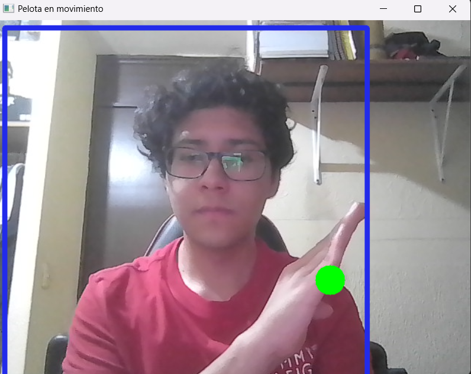

# Actividad 11

## Instrucciones  

Hacer un cuadro con una pelota que puedas mover con la mano y que, si sale del cuadro, vuelva al centro de este mismo.

```python
import numpy as np
import cv2 as cv

# Iniciar la captura de video desde la cámara
cap = cv.VideoCapture(0)

# Parámetros para el flujo óptico Lucas-Kanade
lk_params = dict(winSize=(15, 15), maxLevel=2,
                 criteria=(cv.TERM_CRITERIA_EPS | cv.TERM_CRITERIA_COUNT, 10, 0.03))

# Leer el primer frame de la cámara
ret, first_frame = cap.read()
prev_gray = cv.cvtColor(first_frame, cv.COLOR_BGR2GRAY)

# Dimensiones del frame
frame_height, frame_width = prev_gray.shape

# Posición inicial de la pelotita (un único punto en el centro de la imagen)
center_x, center_y = frame_width // 2, frame_height // 2
ball_pos = np.array([[center_x, center_y]], dtype=np.float32)
ball_pos = ball_pos[:, np.newaxis, :]

# Definir los límites del rectángulo
rect_top_left = (10, 10)
rect_bottom_right = (500, 500)

while True:
    # Capturar el siguiente frame
    ret, frame = cap.read()
    if not ret:
        break

    # Convertir el frame a escala de grises
    gray_frame = cv.cvtColor(frame, cv.COLOR_BGR2GRAY)

    # Calcular el flujo óptico para mover la pelotita
    new_ball_pos, st, err = cv.calcOpticalFlowPyrLK(prev_gray, gray_frame, ball_pos, None, **lk_params)

    # Si se detecta el nuevo movimiento, actualizar la posición de la pelotita
    if new_ball_pos is not None:
        ball_pos = new_ball_pos

        # Extraer las coordenadas de la pelota
        a, b = ball_pos.ravel()

        # Verificar si la pelotita está fuera del rectángulo
        if not (rect_top_left[0] < a < rect_bottom_right[0] and rect_top_left[1] < b < rect_bottom_right[1]):
            # Si está fuera, regresar la pelota al centro
            ball_pos = np.array([[center_x, center_y]], dtype=np.float32)
            ball_pos = ball_pos[:, np.newaxis, :]
            a, b = center_x, center_y

        # Dibujar la pelotita en su nueva posición
        frame = cv.circle(frame, (int(a), int(b)), 20, (0, 255, 0), -1)

    # Dibujar el rectángulo
    cv.rectangle(frame, rect_top_left, rect_bottom_right, (234, 43, 34), 5)

    # Mostrar solo una ventana con la pelotita en movimiento
    cv.imshow('Pelota en movimiento', frame)

    # Actualizar el frame anterior para el siguiente cálculo
    prev_gray = gray_frame.copy()

    # Presionar 'Esc' para salir
    if cv.waitKey(30) & 0xFF == 27:
        break

# Liberar la captura y destruir todas las ventanas
cap.release()
cv.destroyAllWindows()
```  
  
  