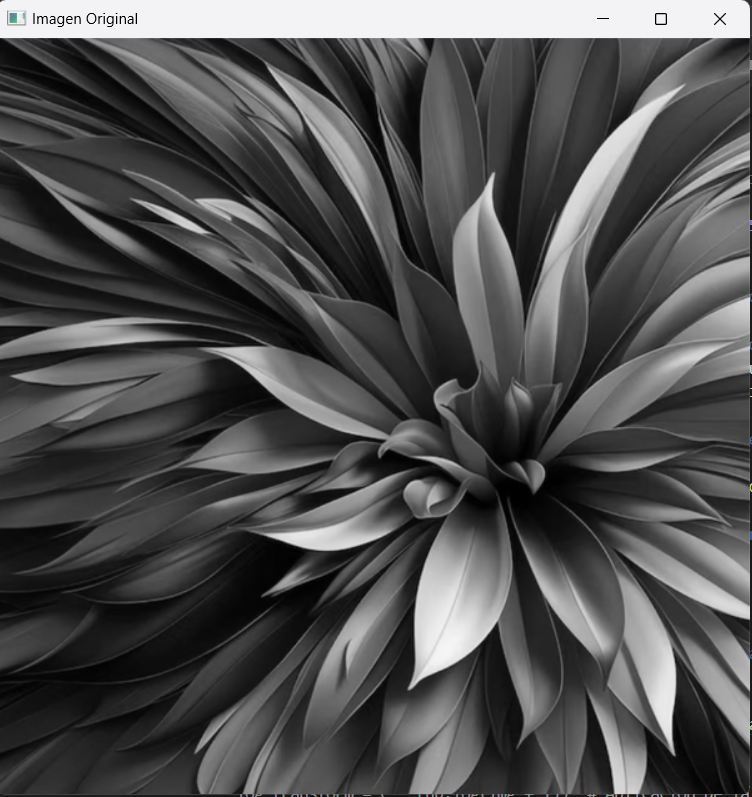

# Actividad 2

## Instrucciones

Generar al menos cinco operadores puntuales utilizando la imagen generada o una imagen previamente cargada.

**Imagen Original**


**Primer Operador**
```python
import cv2 as cv

img = cv.imread('mandala.png', 0)
cv.imshow('salida', img)
x,y=img.shape
for i in range(x):
        for j in range(y):
                if(img[i,j]<100):
                        img[i,j]=25
                else:
                        img[i,j]=170

cv.imshow('OP1', img)
print( img.shape, x , y)
cv.waitKey(0)
cv.destroyAllWindows()
```

**Imagen en blanco y negro**


**Imagen 1: Negavita**


**Segundo Operador**
```python
import cv2 as cv

img = cv.imread('mandala.png', 0)
cv.imshow('salida', img)
x,y=img.shape
for i in range(x):
        for j in range(y):
                if(img[i,j]<150):
                        img[i,j]=255
                else:
                        img[i,j]=0

cv.imshow('OP2', img)
print( img.shape, x , y)
cv.waitKey(0)
cv.destroyAllWindows()
```
**Imagen 2**


**Tercer Operador**
```python
import cv2 as cv

img = cv.imread('mandala.png', 0)
cv.imshow('salida', img)
x,y=img.shape
for i in range(x):
        for j in range(y):
                if(img[i,j]<50):
                        img[i,j]=255
                else:
                        img[i,j]=50

cv.imshow('OP3', img)
print( img.shape, x , y)
cv.waitKey(0)
cv.destroyAllWindows()
```
**Imagen 3**


**Cuarto Operador**
```python
import cv2 as cv

img = cv.imread('mandala.png', 0)
cv.imshow('salida', img)
x,y=img.shape
for i in range(x):
        for j in range(y):
                if(img[i,j]>50):
                        img[i,j]=255
                else:
                        img[i,j]=0

cv.imshow('OP4', img)
print( img.shape, x , y)
cv.waitKey(0)
cv.destroyAllWindows()
```
**Imagen 4**


**Quinto Operador**
```python
import cv2 as cv

img = cv.imread('mandala.png', 0)
cv.imshow('salida', img)
x,y=img.shape
for i in range(x):
        for j in range(y):
                if(img[i,j]>100):
                        img[i,j]=255
                else:
                        img[i,j]=150

cv.imshow('OP5', img)
print( img.shape, x , y)
cv.waitKey(0)
cv.destroyAllWindows()
```
**Imagen 5**


**Operador extra: Imagen negativa**
```python
import cv2 as cv

img = cv.imread('mandala.png', 0)
cv.imshow('salida', img)
x,y=img.shape
for i in range(x):
        for j in range(y):
                if(img[i,j]>150):
                        img[i,j]=255
                else:
                        img[i,j]=0

cv.imshow('negativo', img)
print( img.shape, x , y)
cv.waitKey(0)
cv.destroyAllWindows()
```

**Imagen extra: Negavita**
