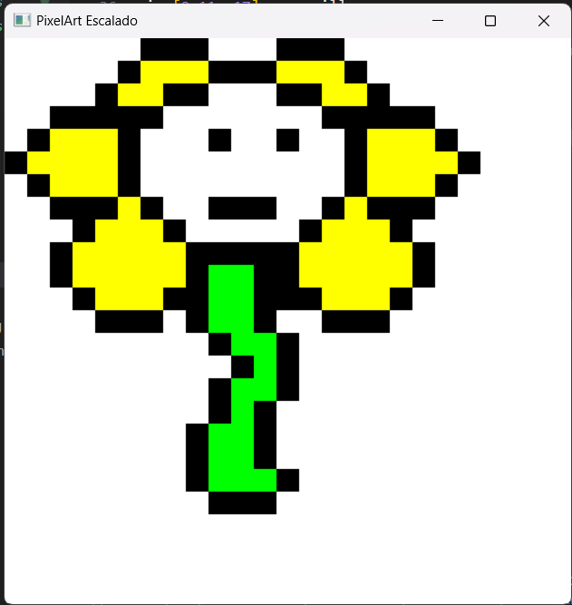

# Actividad 1

## Instrucciones

Generar una imagen tipo pixel art utilizando una matriz de enteros en el rango de 0 a 255.
Utilicé un formato RGB, principalmente para hacer algo bonito.

```python
import numpy as np
import cv2 as cv

# Crear una imagen de 25x25 píxeles con 3 canales (BGR) y fondo blanco
img = np.ones((25, 25, 3), dtype=np.uint8) * 255  # Blanco como valor inicial

# Definir los colores en formato BGR
negro = [0, 0, 0]        # Negro
verde = [0, 255, 0]      # Verde
amarillo = [0, 255, 255] # Amarillo
blanco = [255, 255, 255] # Blanco (fondo)

# Colocar píxeles amarillos en posiciones personalizadas
img[1, 6:9] = amarillo 
img[1, 12:15] = amarillo 
img[2, 5:7] = amarillo 
img[2, 14:16] = amarillo 

img[4, 2:5] = amarillo 
img[4, 16:19] = amarillo 
img[5, 1:5] = amarillo 
img[5, 16:20] = amarillo 
img[6, 2:5] = amarillo 
img[6, 16:19] = amarillo 

img[9:11, 3] = amarillo 
img[8:12, 4] = amarillo 
img[7:12, 5] = amarillo 
img[8:12, 6] = amarillo 
img[9:11, 7] = amarillo

img[9:11, 13] = amarillo 
img[8:12, 14] = amarillo 
img[7:12, 15] = amarillo 
img[8:12, 16] = amarillo 
img[9:11, 17] = amarillo

# Colocar algunos píxeles negros para crear un patrón adicional
posiciones_negras = [(1, 5), (1, 15), (2, 4), (2, 16), (4, 1), (4, 19), 
                     (5, 0), (5, 20), (6, 1), (6, 19), (4, 9), (4, 12),
                     (7, 6), (7, 14), (8, 7), (8, 13), (11, 3), (11, 17),
                     (13, 9), (14, 10), (19, 12)] # y, x
for pos in posiciones_negras:
    img[pos[0], pos[1]] = negro

img[0, 6:9] = negro    # Pinta los píxeles de la fila 5 desde la columna 1 hasta la columna 6
img[0, 12:15] = negro  # Horizontal

img[1, 9:12] = negro  

img[2, 7:9] = negro  
img[2, 12:14] = negro  

img[3, 2:7] = negro  
img[3, 14:19] = negro  

img[4:7, 5] = negro   # Vertical
img[4:7, 15] = negro  

img[7, 2:5] = negro  
img[7, 16:19] = negro  

img[7, 9:12] = negro  

img[7:9, 3] = negro
img[7:9, 17] = negro
 
img[9, 9:13] = negro

img[9:11, 2] = negro
img[9:13, 8] = negro
img[9:13, 11] = negro
img[9:12, 12] = negro
img[9:11, 18] = negro
  
img[11, 7:9] = negro
img[11, 11:14] = negro

img[12, 4:7] = negro
img[12, 14:17] = negro
  
img[17:20, 8] = negro   # Vertical
img[15:17, 9] = negro   # Vertical
img[16:19, 11] = negro   # Vertical
img[13:16, 12] = negro   # Vertical
img[20, 9:12] = negro   # Horizontal

# Colocar algunos píxeles verdes para otro patrón
posiciones_verdes = [] # x,y 
for pos in posiciones_verdes:
    img[pos[0], pos[1]] = verde
    
img[10:13, 9] = verde   # Vertical
img[10:14, 10] = verde   # Vertical
img[13:16, 11] = verde   # Vertical
img[17:19, 9] = verde   # Vertical
img[15:19, 10] = verde   # Vertical
img[19, 9:12] = verde   # Horizontal


# Escalar la imagen para que se vea más grande (por ejemplo, 20x más grande)
factor_escala = 20
img_grande = cv.resize(img, (25 * factor_escala, 25 * factor_escala), interpolation=cv.INTER_NEAREST)

# Mostrar la imagen escalada
cv.imshow('PixelArt Escalado', img_grande)
cv.waitKey(0)
cv.destroyAllWindows()
```
**Dibujo final** 

