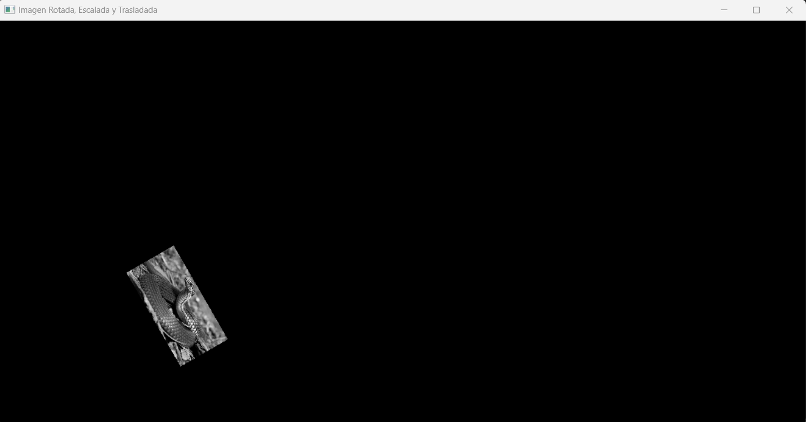

# Proyecto Individual

## Instrucciones

Se debe hacer un mapeo con una figura bidimensional (triángulo, cuadrado o círculo) con traslación, rotación y escalamiento mediante el código de los puntos. Se usa el flujo óptico para que, mediante los controles, se pueda rotar, hacer zoom y trasladar el objeto. 

**Imagen del triángulo**


**Imagen de la cámara con puntos**


```python
import cv2 as cv
import numpy as np
import math

# Cargar la imagen en escala de grises
img = cv.imread('tr.png', 0)

# Obtener el tamaño de la imagen original
x, y = img.shape

# Crear una imagen vacía para almacenar el resultado, con espacio para traslación y escalado
imgRST = np.zeros((int(x * 1.5), int(y * 1.5)), dtype=np.uint8)
xx, yy = imgRST.shape

# Definir el desplazamiento en x e y
dx, dy = 10, 10  

# Definir el factor de escala
scale = 0.2  

# Calcular el centro de la imagen
cx, cy = int(x // 2), int(y // 2)

# Definir el ángulo de rotación (en grados) y convertirlo a radianes
angle = 60
theta = math.radians(angle)

# Rotar, escalar y trasladar la imagen directamente en las fórmulas de coordenadas
for i in range(x):
    for j in range(y):
        # Aplicar la rotación, escala y traslación en una sola fórmula
        rotated_x = int(((j - cx) * math.cos(theta) * scale) - ((i - cy) * math.sin(theta) * scale) + cx + dx)
        rotated_y = int(((j - cx) * math.sin(theta) * scale) + ((i - cy) * math.cos(theta) * scale) + cy + dy)
        
        # Verificar si el nuevo píxel está dentro de los límites de la imagen resultante
        if 0 <= rotated_x < yy and 0 <= rotated_y < xx:
            imgRST[rotated_y, rotated_x] = img[i, j]

# Mostrar la imagen original y la rotada con escalado y traslación
cv.imshow('Imagen Original', img)
cv.imshow('Imagen Rotada, Escalada y Trasladada', imgRST)
cv.waitKey(0)
cv.destroyAllWindows()
```



**Segundo Ejercicio**

2.1. Rotar 30 a la derecha  
2.2. Rotar 60 a la izquierda  
2.3. Escalar 2  

```python
import numpy as np
import cv2 as cv

def inicializar_lienzo(ancho, alto):
    """Crea un lienzo blanco y devuelve sus parámetros iniciales."""
    lienzo = np.ones((alto, ancho, 3), dtype=np.uint8) * 255
    centro = np.array([ancho // 3, alto // 4], dtype=np.float32)
    tamanio = 100
    angulo = 0
    return lienzo, centro, tamanio, angulo

def definir_puntos_iniciales(centro):
    """Define los puntos iniciales del triángulo en relación al centro."""
    return np.array([
        [centro[0] - 200, centro[1]],
        [centro[0], centro[1]],
        [centro[0] + 200, centro[1]]
    ], dtype=np.float32)

def dibujar_triangulo(lienzo, centro, tamanio, angulo):
    """Dibuja un triángulo equilátero en el lienzo."""
    mitad_tamanio = tamanio // 2
    altura = int(np.sqrt(tamanio**2 - mitad_tamanio**2))
    puntos = np.array([
        [-mitad_tamanio, altura // 2],
        [mitad_tamanio, altura // 2],
        [0, -altura // 2]
    ], dtype=np.float32)

    matriz_rotacion = cv.getRotationMatrix2D((0, 0), angulo, 1)
    puntos_rotados = np.dot(puntos, matriz_rotacion[:, :2].T)
    puntos_trasladados = puntos_rotados + centro
    puntos_trasladados = puntos_trasladados.astype(int)

    cv.fillPoly(lienzo, [puntos_trasladados], color=(0, 255, 0))

def configurar_camara():
    """Configura la cámara y devuelve el primer cuadro en escala de grises."""
    camara = cv.VideoCapture(0)
    _, cuadro_inicial = camara.read()
    gris_inicial = cv.cvtColor(cuadro_inicial, cv.COLOR_BGR2GRAY)
    return camara, gris_inicial

def ajustar_parametros_opticos():
    """Devuelve los parámetros para el cálculo del flujo óptico."""
    return dict(winSize=(15, 15), maxLevel=2,
                criteria=(cv.TERM_CRITERIA_EPS | cv.TERM_CRITERIA_COUNT, 10, 0.03))

def procesar_movimiento(puntos_actuales, puntos_seguimiento, puntos_iniciales, centro, tamanio, angulo, parametros):
    """Actualiza las propiedades del triángulo según el movimiento detectado."""
    umbral_seguimiento, umbral_reset, umbral_movimiento, paso_escala, paso_rotacion = parametros
    multiplicar = 1.5
    for i, (nuevo, viejo) in enumerate(zip(puntos_actuales, puntos_seguimiento)):
        a, b = (int(x) for x in nuevo.ravel())
        c, d = (int(x) for x in viejo.ravel())
        distancia_origen = np.linalg.norm(nuevo.ravel() - puntos_iniciales[i])
        distancia_movimiento = np.linalg.norm(nuevo.ravel() - viejo.ravel())

        if distancia_movimiento >= umbral_movimiento and distancia_origen <= umbral_seguimiento:
            if i == 0:  # Escalar
                tamanio += (paso_escala * multiplicar) if nuevo.ravel()[0] < viejo.ravel()[0] else -paso_escala
                tamanio = max(paso_escala, tamanio)
            elif i == 1:  # Mover
                centro += (nuevo.ravel() - viejo.ravel()) * 0.5
            elif i == 2:  # Rotar
                angulo += (paso_rotacion * multiplicar) if nuevo.ravel()[0] > viejo.ravel()[0] else -paso_rotacion

        if distancia_origen > umbral_reset:
            puntos_seguimiento[i] = puntos_iniciales[i]
    return centro, tamanio, angulo

# Configuración inicial
ancho, alto = 1000, 1000
lienzo, centro, tamanio, angulo = inicializar_lienzo(ancho, alto)
puntos_iniciales = definir_puntos_iniciales(centro)
camara, gris_inicial = configurar_camara()
parametros_opticos = ajustar_parametros_opticos()
puntos_seguimiento = puntos_iniciales[:, np.newaxis, :]
parametros_control = (150, 200, 5, 2, 1)

while True:
    lienzo[:] = 255
    _, cuadro_actual = camara.read()
    
    cuadro_actual = cv.flip(cuadro_actual, 1)

    gris_actual = cv.cvtColor(cuadro_actual, cv.COLOR_BGR2GRAY)

    for px, py in puntos_iniciales:
        cuadro_actual = cv.circle(cuadro_actual, (int(px), int(py)), 5, (0, 0, 0), -1)

    puntos_actuales, estado, error = cv.calcOpticalFlowPyrLK(
        gris_inicial, gris_actual, puntos_seguimiento, None, **parametros_opticos
    )

    if puntos_actuales is not None and estado is not None:
        centro, tamanio, angulo = procesar_movimiento(
            puntos_actuales, puntos_seguimiento, puntos_iniciales, centro, tamanio, angulo, parametros_control
        )
        for i, (nuevo, viejo) in enumerate(zip(puntos_actuales, puntos_seguimiento)):
            a, b = (int(x) for x in nuevo.ravel())
            c, d = (int(x) for x in viejo.ravel())
            cuadro_actual = cv.circle(cuadro_actual, (a, b), 3, (0, 0, 255), -1)
            cuadro_actual = cv.line(cuadro_actual, (c, d), (a, b), (0, 0, 0), 2)

    dibujar_triangulo(lienzo, centro, tamanio, angulo)

    cv.imshow("Camara", cuadro_actual)
    cv.imshow("Triángulo", lienzo)

    gris_inicial = gris_actual.copy()

    if cv.waitKey(1) & 0xFF == 27:
        break

camara.release()
cv.destroyAllWindows()

```

**Triángulo cambiado**


**Movimientos**

- El primer punto, el de la izquierda, escala el triángulo. Si se mueve hacia arriba, hace el triángulo más grande. Por su lado, si se mueve hacia abajo el punto, se hace más pequeño el triángulo.

- El punto de en medio, traslada el triángulo hacia donde se mueva el punto.

- El último punto, el de la derecha, rota el triángulo. Si se mueve hacia la derecha el punto, el triángulo rota en sentido de las manecillas del reloj. Si el punto se mueve hacia la izqueirda, el triángulo rota en sentido antihorario.

