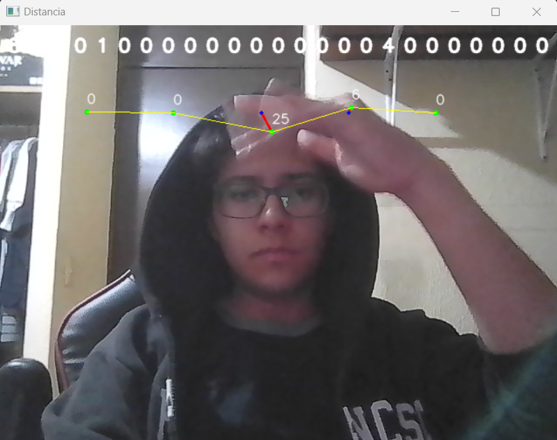

# Actividad 12

## Instrucciones

Realizar una red de tenis con las pelotas y, después, hacer calcular la distancia euclidiana sobre cada punto de la parte superior e imprimirlo.  

**Red de puntos**  

```python
import numpy as np
import cv2 as cv

cap = cv.VideoCapture(0)

# Parámetros de Lucas-Kanade con menor sensibilidad de movimiento
lkparm = dict(winSize=(15, 15), maxLevel=2,
              criteria=(cv.TERM_CRITERIA_EPS | cv.TERM_CRITERIA_COUNT, 10, 0.1))

# Primer frame y puntos iniciales en la cuadrícula
_, vframe = cap.read()
vgris = cv.cvtColor(vframe, cv.COLOR_BGR2GRAY)
p0 = np.array([(100, 100), (200, 100), (300, 100), (400, 100), (500, 100), (600, 100),
               (100, 200), (200, 200), (300, 200), (400, 200), (500, 200), (600, 200),
               (100, 300), (200, 300), (300, 300), (400, 300), (500, 300), (600, 300),
               (100, 400), (200, 400), (300, 400), (400, 400), (500, 400), (600, 400)])

p0 = np.float32(p0[:, np.newaxis, :])

# Mascara para dibujar las trayectorias
mask = np.zeros_like(vframe)

# Cadena para concatenar las distancias
distances_string = ""

while True:
    _, frame = cap.read()
    fgris = cv.cvtColor(frame, cv.COLOR_BGR2GRAY)
    p1, st, err = cv.calcOpticalFlowPyrLK(vgris, fgris, p0, None, **lkparm)

    if p1 is None:
        # Restablecer puntos si no hay detección
        vgris = cv.cvtColor(vframe, cv.COLOR_BGR2GRAY)
        p0 = np.array([(100, 100), (200, 100), (300, 100), (400, 100), (500, 100)])
        p0 = np.float32(p0[:, np.newaxis, :])
        mask = np.zeros_like(vframe)
        cv.imshow('ventana', frame)
    else:
        bp1 = p1[st == 1]
        bp0 = p0[st == 1]

        current_distances = []  # Lista para los valores de distancia actuales

        for i, (nv, vj) in enumerate(zip(bp1, bp0)):
            a, b = (int(x) for x in nv.ravel())
            c, d = (int(x) for x in vj.ravel())
            dist = int(np.linalg.norm(nv.ravel() - vj.ravel()))  # Distancia entre puntos

            # Agregar la distancia a la lista temporal
            current_distances.append(dist)

            # Dibujar líneas y círculos entre los puntos
            frame = cv.line(frame, (c, d), (a, b), (0, 0, 255), 2)
            frame = cv.circle(frame, (c, d), 2, (255, 0, 0), -1)
            frame = cv.circle(frame, (a, b), 3, (0, 255, 0), -1)

            # Mostrar la distancia sobre el punto (a, b)
            cv.putText(frame, str(dist), (a, b - 10), cv.FONT_HERSHEY_SIMPLEX, 0.5, (255, 255, 255), 1, cv.LINE_AA)

            # Conectar el punto actual con sus vecinos cercanos
            for j, (nv2, vj2) in enumerate(zip(bp1, bp0)):
                if i != j:  # No conectar el punto consigo mismo
                    a2, b2 = (int(x) for x in nv2.ravel())
                    distancia_entre_puntos = np.linalg.norm(nv.ravel() - nv2.ravel())
                    if distancia_entre_puntos < 120:  # Umbral para vecinos cercanos
                        frame = cv.line(frame, (a, b), (a2, b2), (0, 255, 255), 1)

        # Concatenar las distancias
        for dist in current_distances:
            distances_string += str(dist) + " "  # Concatenar el número de distancia seguido de un espacio

        # Mostrar la cadena concatenada en la esquina superior izquierda
        cv.putText(frame, distances_string, (10, 30), cv.FONT_HERSHEY_SIMPLEX, 0.7, (255, 255, 255), 2, cv.LINE_AA)

        cv.imshow('Distancia', frame)

        # Actualizar el frame en escala de grises
        vgris = fgris.copy()

        # Salir si se presiona la tecla ESC (código 27)
        if (cv.waitKey(1) & 0xff) == 27:
            break

cap.release()
cv.destroyAllWindows()
```  

  

**Distancia euclidiana**  

```python
import numpy as np
import cv2 as cv

cap = cv.VideoCapture(0)

# Parámetros de Lucas-Kanade con menor sensibilidad de movimiento
lkparm = dict(winSize=(15, 15), maxLevel=2,
              criteria=(cv.TERM_CRITERIA_EPS | cv.TERM_CRITERIA_COUNT, 10, 0.1))

# Primer frame y puntos iniciales en la cuadrícula
_, vframe = cap.read()
vgris = cv.cvtColor(vframe, cv.COLOR_BGR2GRAY)
p0 = np.array([(100, 100), (200, 100), (300, 100), (400, 100), (500, 100), (600, 100)])
              # (100, 200), (200, 200), (300, 200), (400, 200), (500, 200), (600, 200),
              # (100, 300), (200, 300), (300, 300), (400, 300), (500, 300), (600, 300),
              # (100, 400), (200, 400), (300, 400), (400, 400), (500, 400), (600, 400)])

p0 = np.float32(p0[:, np.newaxis, :])

# Mascara para dibujar las trayectorias
mask = np.zeros_like(vframe)

# Cadena para concatenar las distancias
distances_string = ""

while True:
    _, frame = cap.read()
    fgris = cv.cvtColor(frame, cv.COLOR_BGR2GRAY)
    p1, st, err = cv.calcOpticalFlowPyrLK(vgris, fgris, p0, None, **lkparm)

    if p1 is None:
        # Restablecer puntos si no hay detección
        vgris = cv.cvtColor(vframe, cv.COLOR_BGR2GRAY)
        p0 = np.array([(100, 100), (200, 100), (300, 100), (400, 100), (500, 100)])
        p0 = np.float32(p0[:, np.newaxis, :])
        mask = np.zeros_like(vframe)
        cv.imshow('ventana', frame)
    else:
        bp1 = p1[st == 1]
        bp0 = p0[st == 1]

        current_distances = []  # Lista para los valores de distancia actuales

        for i, (nv, vj) in enumerate(zip(bp1, bp0)):
            a, b = (int(x) for x in nv.ravel())
            c, d = (int(x) for x in vj.ravel())
            dist = int(np.linalg.norm(nv.ravel() - vj.ravel()))  # Distancia entre puntos

            # Agregar la distancia a la lista temporal
            current_distances.append(dist)

            # Dibujar líneas y círculos entre los puntos
            frame = cv.line(frame, (c, d), (a, b), (0, 0, 255), 2)
            frame = cv.circle(frame, (c, d), 2, (255, 0, 0), -1)
            frame = cv.circle(frame, (a, b), 3, (0, 255, 0), -1)

            # Mostrar la distancia sobre el punto (a, b)
            cv.putText(frame, str(dist), (a, b - 10), cv.FONT_HERSHEY_SIMPLEX, 0.5, (255, 255, 255), 1, cv.LINE_AA)

            # Conectar el punto actual con sus vecinos cercanos
            for j, (nv2, vj2) in enumerate(zip(bp1, bp0)):
                if i != j:  # No conectar el punto consigo mismo
                    a2, b2 = (int(x) for x in nv2.ravel())
                    distancia_entre_puntos = np.linalg.norm(nv.ravel() - nv2.ravel())
                    if distancia_entre_puntos < 120:  # Umbral para vecinos cercanos
                        frame = cv.line(frame, (a, b), (a2, b2), (0, 255, 255), 1)

        # Concatenar las distancias
        for dist in current_distances:
            distances_string += str(dist) + " "  # Concatenar el número de distancia seguido de un espacio

        # Mostrar la cadena concatenada en la esquina superior izquierda
        cv.putText(frame, distances_string, (10, 30), cv.FONT_HERSHEY_SIMPLEX, 0.7, (255, 255, 255), 2, cv.LINE_AA)

        cv.imshow('Distancia', frame)

        # Actualizar el frame en escala de grises
        vgris = fgris.copy()

        # Salir si se presiona la tecla ESC (código 27)
        if (cv.waitKey(1) & 0xff) == 27:
            break

cap.release()
cv.destroyAllWindows()
```  

  