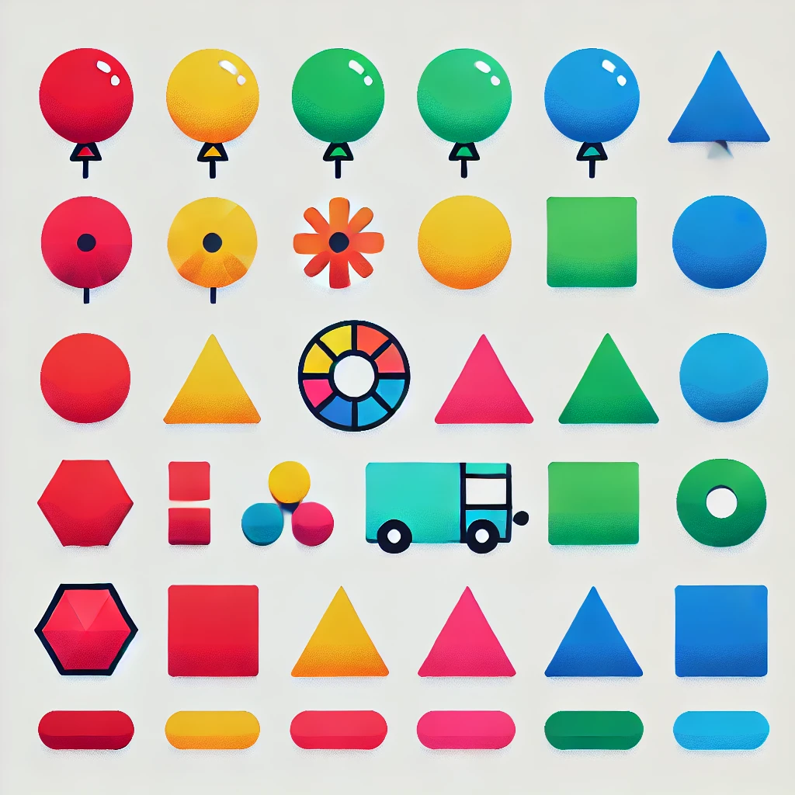

# Actividad 10

## Instrucciones

Segmenta los colores de las figuras en rojo, verde, azul, amarillo y magenta.  


**Imagen original de las figuras**  

  


```python
import cv2 as cv
import numpy as np

# Leer la imagen en formato BGR
imagen = cv.imread('figuras.png', 1)

# Reducir la imagen a la mitad de su tamaño
ancho = int(imagen.shape[1] * 0.7)
alto = int(imagen.shape[0] * 0.7)
imagen_reducida = cv.resize(imagen, (ancho, alto))

# Convertir la imagen de BGR a HSV
imagen_hsv = cv.cvtColor(imagen_reducida, cv.COLOR_BGR2HSV)

# Definir los rangos de color en HSV para diferentes colores
# Rango para rojo (dos rangos por el espacio que ocupa el color rojo en el espectro HSV)
rojo_bajo1 = (0, 40, 40)
rojo_alto1 = (7, 255, 255)
rojo_bajo2 = (170, 40, 40)
rojo_alto2 = (180, 255, 255)

# Rango para verde
verde_bajo = (35, 40, 40)
verde_alto = (85, 255, 255)

# Rango para amarillo
amarillo_bajo = (15, 40, 40)
amarillo_alto = (40, 255, 255)

# Rango para azul
azul_bajo = (87, 40, 40)
azul_alto = (130, 255, 255)

# Rango para magenta
magenta_bajo = (140, 40, 40)
magenta_alto = (170, 255, 255)

# Crear las máscaras para cada color
# Para el rojo 
mascara_rojo1 = cv.inRange(imagen_hsv, rojo_bajo1, rojo_alto1)
mascara_rojo2 = cv.inRange(imagen_hsv, rojo_bajo2, rojo_alto2)
mascara_rojo = cv.bitwise_or(mascara_rojo1, mascara_rojo2)

mascara_verde = cv.inRange(imagen_hsv, verde_bajo, verde_alto)
mascara_amarillo = cv.inRange(imagen_hsv, amarillo_bajo, amarillo_alto)
mascara_azul = cv.inRange(imagen_hsv, azul_bajo, azul_alto)
mascara_magenta = cv.inRange(imagen_hsv, magenta_bajo, magenta_alto)

# Crear las imágenes resaltando cada color en su respectiva máscara
res_rojo = cv.bitwise_and(imagen_reducida, imagen_reducida, mask=mascara_rojo)
res_verde = cv.bitwise_and(imagen_reducida, imagen_reducida, mask=mascara_verde)
res_amarillo = cv.bitwise_and(imagen_reducida, imagen_reducida, mask=mascara_amarillo)
res_azul = cv.bitwise_and(imagen_reducida, imagen_reducida, mask=mascara_azul)
res_magenta = cv.bitwise_and(imagen_reducida, imagen_reducida, mask=mascara_magenta)

# Mostrar las imágenes con los colores resaltados
cv.imshow('Imagen Original Reducida', imagen_reducida)
cv.imshow('Color Rojo Resaltado', res_rojo)
cv.imshow('Color Verde Resaltado', res_verde)
cv.imshow('Color Amarillo Resaltado', res_amarillo)
cv.imshow('Color Azul Resaltado', res_azul)
cv.imshow('Color Magenta Resaltado', res_magenta)

# Esperar hasta que se presione una tecla
cv.waitKey(0)
cv.destroyAllWindows()
```  

**Segmentacion rojo**  
  
  
  
**Segmentacion verde**  
  
  
  
**Segmentacion azul**  
  
  
  
**Segmentacion amarillo**  
  
  
  
**Segmentacion magenta**  
  
 