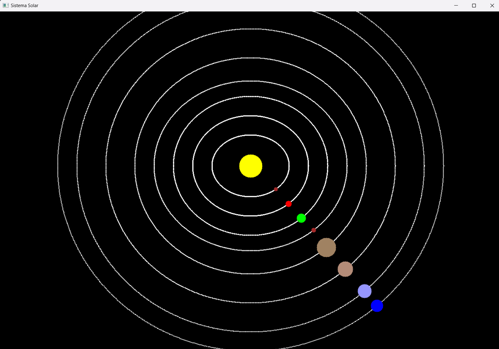

# Actividad 7

## Instrucciones

Realizar un sistema solar.  

```python
import numpy as np
import cv2 as cv

# Definir parámetros del sistema solar desglosados en tablas
orbita_parametros = [
    {'a': 100, 'b': 80},   # Mercurio
    {'a': 150, 'b': 130},   # Venus
    {'a': 200, 'b': 180},   # Tierra
    {'a': 250, 'b': 220},   # Marte
    {'a': 300, 'b': 280},   # Júpiter
    {'a': 375, 'b': 355},   # Saturno
    {'a': 450, 'b': 430},   # Urano
    {'a': 500, 'b': 480},   # Neptuno
]

# Colores actualizados de los planetas
colores_planetas = [
    (42, 42, 165),   # Mercurio (Café)
    (0, 0, 255),     # Venus (Rojo)
    (0, 255, 0),     # Tierra (Verde)
    (42, 42, 165),   # Marte (Café)
    (98, 130, 160), # Júpiter (Café claro)
    (120, 140, 180), # Saturno (Café claro)
    (255, 150, 150),     # Urano (Azul)
    (255, 0, 0)      # Neptuno (Azul)
]

tamanos_planetas = [
    5,  # Mercurio
    8,  # Venus
    12,  # Tierra
    6,  # Marte
    25,  # Júpiter
    20,  # Saturno
    18,  # Urano
    16   # Neptuno
]

# Función para calcular la posición de un planeta en su órbita
def punto_orbita(a, b, t, centro):
    x = int(a * np.cos(t) + centro[0])
    y = int(b * np.sin(t) + centro[1])
    return (x, y)

# Parámetros de la imagen
ancho, alto = 1300, 1000
centro_sol = (650, 400)  
num_puntos = 1000
t_vals = np.linspace(0, 2 * np.pi, num_puntos)  # Valores de t para la animación

# Crear la ventana de la animación
cv.namedWindow('Sistema Solar', cv.WINDOW_AUTOSIZE)

# Ciclo de animación (todos los planetas se mueven a la misma velocidad)
for t in t_vals:
    # Crear un nuevo frame
    imagen = np.zeros((alto, ancho, 3), dtype=np.uint8)
    
    # Dibujar el Sol
    cv.circle(imagen, centro_sol, radius=30, color=(0, 255, 255), thickness=-1)
    
    # Dibujar las órbitas
    for i, orbita in enumerate(orbita_parametros):
        for t_tray in t_vals:
            pt_tray = punto_orbita(orbita['a'], orbita['b'], t_tray, centro_sol)
            cv.circle(imagen, pt_tray, radius=1, color=(255, 255, 255), thickness=-1)
    
    # Dibujar los planetas (sin velocidad diferenciada)
    for i in range(len(orbita_parametros)):
        punto = punto_orbita(orbita_parametros[i]['a'], orbita_parametros[i]['b'], t, centro_sol)
        cv.circle(imagen, punto, radius=tamanos_planetas[i], color=colores_planetas[i], thickness=-1)
    
    # Mostrar la imagen con los planetas en movimiento
    cv.imshow('Sistema Solar', imagen)
    
    # Condición para salir
    if cv.waitKey(10) & 0xFF == ord('q'):
        break

# Cerrar las ventanas cuando la animación termine
cv.destroyAllWindows()
```  

**Sistema Solar**  


