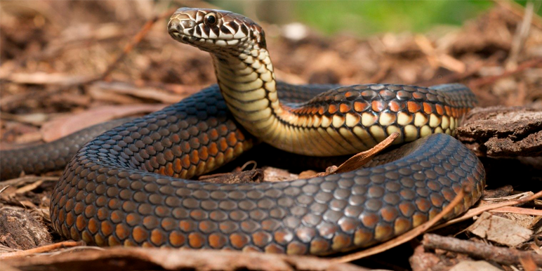
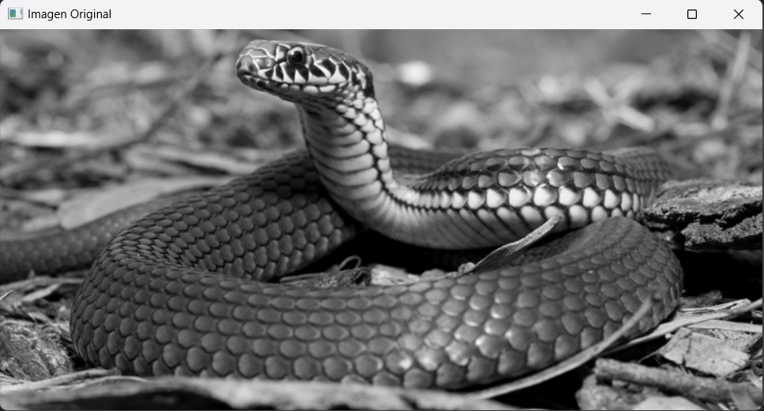
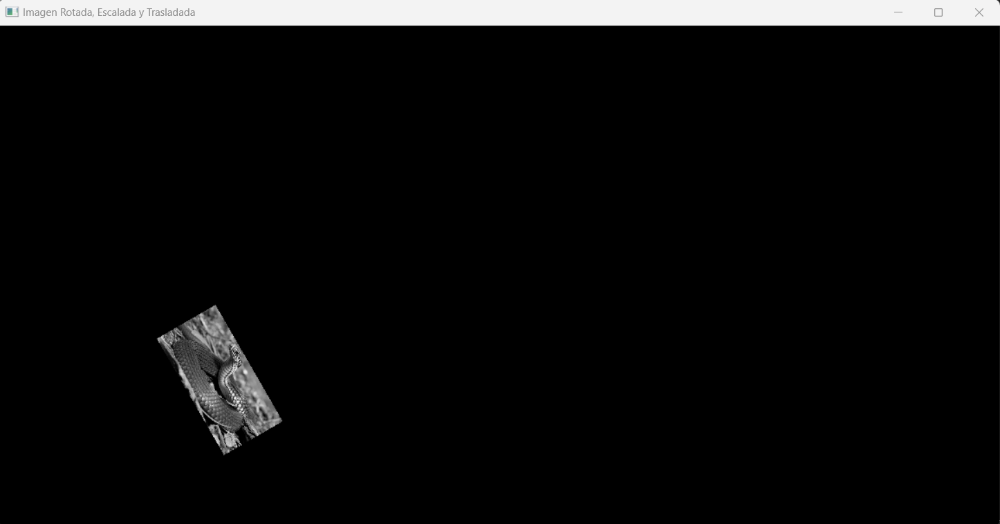
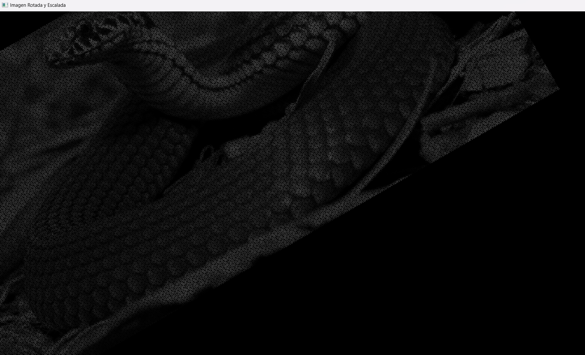
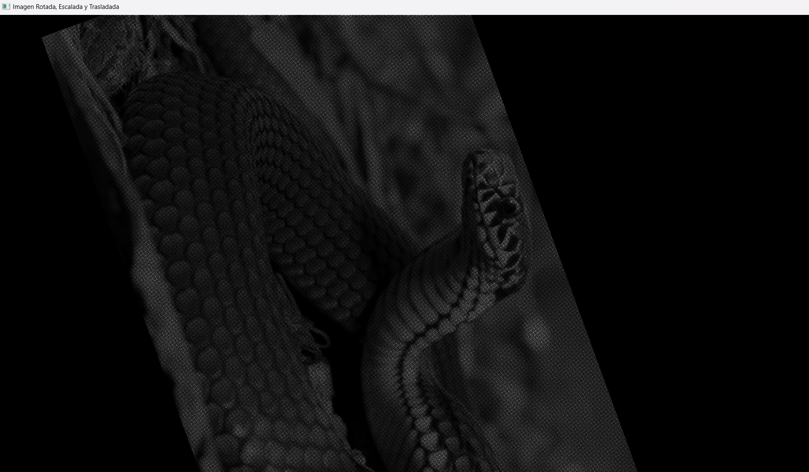
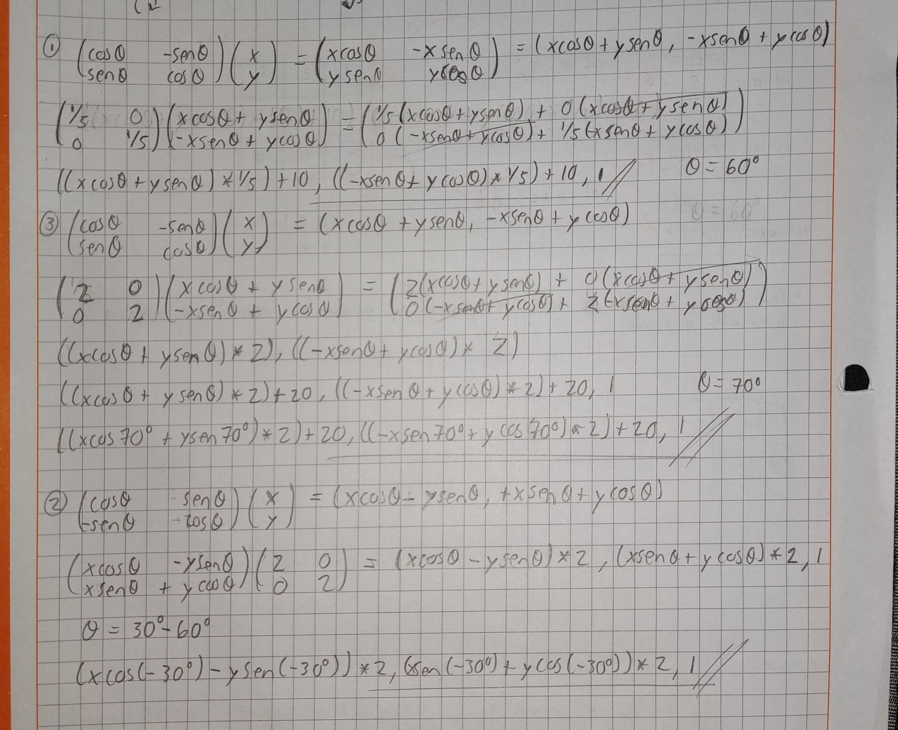

# Actividad 3

## Instrucciones

Aplicar las transformaciones geométricas vistas en clase.

**Imagen Original**



**Imagen Original en blanco y negro**



**Primer Ejercicio**

1.1. Rotar 60  
1.2. Trasladar 10px  
1.3. Escalar 1/5  

```python
import cv2 as cv
import numpy as np
import math

# Cargar la imagen en escala de grises
img = cv.imread('tr.png', 0)

# Obtener el tamaño de la imagen original
x, y = img.shape

# Crear una imagen vacía para almacenar el resultado, con espacio para traslación y escalado
imgRST = np.zeros((int(x * 1.5), int(y * 1.5)), dtype=np.uint8)
xx, yy = imgRST.shape

# Definir el desplazamiento en x e y
dx, dy = 10, 10  

# Definir el factor de escala
scale = 0.2  

# Calcular el centro de la imagen
cx, cy = int(x // 2), int(y // 2)

# Definir el ángulo de rotación (en grados) y convertirlo a radianes
angle = 60
theta = math.radians(angle)

# Rotar, escalar y trasladar la imagen directamente en las fórmulas de coordenadas
for i in range(x):
    for j in range(y):
        # Aplicar la rotación, escala y traslación en una sola fórmula
        rotated_x = int(((j - cx) * math.cos(theta) * scale) - ((i - cy) * math.sin(theta) * scale) + cx + dx)
        rotated_y = int(((j - cx) * math.sin(theta) * scale) + ((i - cy) * math.cos(theta) * scale) + cy + dy)
        
        # Verificar si el nuevo píxel está dentro de los límites de la imagen resultante
        if 0 <= rotated_x < yy and 0 <= rotated_y < xx:
            imgRST[rotated_y, rotated_x] = img[i, j]

# Mostrar la imagen original y la rotada con escalado y traslación
cv.imshow('Imagen Original', img)
cv.imshow('Imagen Rotada, Escalada y Trasladada', imgRST)
cv.waitKey(0)
cv.destroyAllWindows()
```



**Segundo Ejercicio**

2.1. Rotar 30 a la derecha
2.2. Rotar 60 a la izquierda
2.3. Escalar 2

```python
import cv2 as cv
import numpy as np
import math

# Cargar la imagen en escala de grises
img = cv.imread('tr.png', 0)

# Obtener el tamaño de la imagen original
x, y = img.shape

# Crear una imagen vacía para almacenar el resultado con suficiente espacio
imgRS = np.zeros((int(x * 3), int(y * 3)), dtype=np.uint8)  # Tamaño suficientemente grande para todas las transformaciones
xx, yy = imgRS.shape

# Definir el factor de escala
scale = 2  # Escala de 2 (multiplicación por 2)

# Calcular el centro de la imagen original
cx, cy = int(x // 2), int(y // 2)

# Definir los ángulos de rotación (en grados) y convertirlos a radianes
angle1 = 30  # Rotación en sentido horario
theta1 = math.radians(angle1)

angle2 = 60  # Rotación en sentido antihorario
theta2 = math.radians(-angle2)

# Aplicar la primera rotación (30 grados en sentido horario)
for i in range(x):
    for j in range(y):
         # Primera rotación
        rotated_x1 = int((j - cx) * math.cos(theta1) - (i - cy) * math.sin(theta1) + cx)
        rotated_y1 = int((j - cx) * math.sin(theta1) + (i - cy) * math.cos(theta1) + cy)

        # Aplicar la segunda rotación (60 grados en sentido antihorario) sobre el resultado de la primera
        rotated_x2 = int((rotated_x1 - cx) * math.cos(theta2) - (rotated_y1 - cy) * math.sin(theta2) + cx)
        rotated_y2 = int((rotated_x1 - cx) * math.sin(theta2) + (rotated_y1 - cy) * math.cos(theta2) + cy)
        
        # Escalar después de las rotaciones
        scaled_x = int(rotated_x2 * scale)
        scaled_y = int(rotated_y2 * scale)

        # Verificar si el píxel escalado está dentro de los límites de la imagen final
        if 0 <= scaled_x < yy and 0 <= scaled_y < xx:
            imgRS[scaled_y, scaled_x] = img[i, j]

# Mostrar la imagen original y la rotada con escalado y traslación
cv.imshow('Imagen Original', img)
cv.imshow('Imagen Rotada y Escalada', imgRS)
cv.waitKey(0)
cv.destroyAllWindows()
```




**Tercer Ejercicio**

3.1. Rotar 70
3.2. Escalar 2
3.3. Trasladar 20px

```python
import cv2 as cv
import numpy as np
import math

# Cargar la imagen en escala de grises
img = cv.imread('tr.png', 0)

# Obtener el tamaño de la imagen original
x, y = img.shape

# Crear una imagen vacía para almacenar el resultado, con espacio para traslación y escalado
imgRST = np.zeros((int(x * 4), int(y * 4)), dtype=np.uint8)
xx, yy = imgRST.shape

# Definir el desplazamiento en x e y
dx, dy = 20, 20 

# Definir el factor de escala
scale = 2  

# Calcular el centro de la imagen
cx, cy = int(x // 2), int(y // 2)

# Definir el ángulo de rotación (en grados) y convertirlo a radianes
angle = 70
theta = math.radians(angle)

# Rotar, escalar y trasladar la imagen directamente en las fórmulas de coordenadas
for i in range(x):
    for j in range(y):
        # Aplicar la rotación, escala y traslación en una sola fórmula
        rotated_x = int(((j - cx) * math.cos(theta) * scale) - ((i - cy) * math.sin(theta) * scale) + cx + dx)
        rotated_y = int(((j - cx) * math.sin(theta) * scale) + ((i - cy) * math.cos(theta) * scale) + cy + dy)
        
        # Verificar si el nuevo píxel está dentro de los límites de la imagen resultante
        if 0 <= rotated_x < yy and 0 <= rotated_y < xx:
            imgRST[rotated_y, rotated_x] = img[i, j]

# Mostrar la imagen original y la rotada con escalado y traslación
cv.imshow('Imagen Original', img)
cv.imshow('Imagen Rotada, Escalada y Trasladada', imgRST)
cv.waitKey(0)
cv.destroyAllWindows()
```



**Ejercicios hechos a mano**


